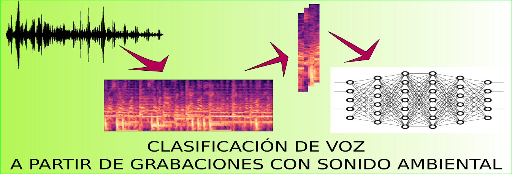

---
# Proyectos 2019-1. Inteligencia Artificial. 

## Prof: Fabio Martínez, Ph.D

---

# Lista de Proyectos
1. [CheckYourZone: Un módelo predictivo de zonas con mayores delitos en Bucaramanga](#proy1)
2. [Detección de *Hate speech* en *Twitter*](#proy2)
3. [Conozca su estabilidad financiera](#proy3)
4. [Análisis de suicidios a nivel mundial y nacional](#proy4)
5. [VoiceHelp](#proy5)
6. [ArtSource](#proy6)
7. [Inteligencia artificial para el uso agricola](#proy7)
8. [Extreme climate even detection](#proy8)
9. [la línea 123 en Bogotá:Predicción de prioridades y prevención de falsas alarmas](#proy9)
10. [Probabilidad de aceptación de una tarjeta de credito](#proy10)
11. [Analisis de la tasa de suicidios a nivel mundial](#proy11)
12. [Grabación de voz a partir de grabaciones con sonido ambiental](#proy12)

---

## CheckYourZone: Un módelo predictivo de zonas con mayores delitos en Bucaramanga 

**Autores: Oscar Esneyder Sinuco, Juan José Arango, Jorge Perea**

**Objetivo: Construir un modelo predictivo para los delitos del municipio de Bucaramanga.**  

- Dataset: Cerca de 100k registros de denuncias desde el año 2009 hasta 2019 (Marzo) y 21 caracteristicas, entre las cuales están dia, mes, lalitud, longitud.
- Modelo: Regresores basados en redes neuronales y Arboles de decisión

[(code)](https://gitlab.com/oscarsinuco/inteligencia) [(video)](https://drive.google.com/open?id=1iuk7cWd8bC9FKuGxIfVF9Cf34_Mz79aN) [(+info)](/sources/CHECK_YOUR_ZONE.pptx)

---

## Detección de *Hate speech* en *Twitter* 

**Autores: Valentina Goyeneche, Liceth Rozo**

**Objetivo:Clasificar tweets en ofensivo, hatespeech o ninguno, para filtrar el contenido que promueva el odio.**  

- Dataset: Un dataset internacional con 24783 tweets, 148.609 "características" y un dataset colombiano con 16044, 143023 características
- Modelo: RandomForest,, SVC, MultinomialNB, OneVsRest, CrossValidation, Kmeans, Red Neuronal.

[(code)](https://github.com/vgoyenechec/Hatespeech-en-twitter/); [(video)](https://www.youtube.com/watch?v=S7qOzw1CTnw&t=); [(+info)](https://github.com/vgoyenechec/Hatespeech-en-twitter/blob/master/presentation/TwitterHSBalanceado.html)

---

## Conozca su estabilidad financiera 

**Autores: Jose Saul Vega, Diego Armando Villamizar**

**Objetivo:**   Predicción de ingresos en adultos, para saber si se encuentran por encima o por debajo de la linea de estabilidad económica

- Dataset: mas de 30000 personas de todo el mundo
- Modelo:  RandomForestClassifier con 34 arboles y 16 de profundidad.
- Librerias: Seaborn (gráfica de relación entre características), Folium (Mapas), LabelEncoder (mapeo de datos) y StandardScaler (normalización de X) de Sklearn

[(code)](https://github.com/JoseSaul23/ProyectoIA); [(video)](https://www.youtube.com/watch?v=xGPHqA5KNMI&feature=youtu.be); [(+info)](https://github.com/JoseSaul23/ProyectoIA/blob/master/PRESENTACION.pptx)

---

## Análisis de suicidios a nivel mundial y nacional 

**Autores: Daniela Quintero, Martha Eliana Arenas, Carlos Daniel Barrera**

**Objetivo:**  Analizar la crisis del suicidio que se vive a nivel mundial, estudiando las principales causas que lleva a que las personas se suiciden. 

- [Dataset](https://www.kaggle.com/russellyates88/suicide-rates-overview-1985-to-2016 ):  
- Modelo:  Clasificador RandomForest, ExtraTree; Algoritmo no supervisado: Kmeans

[(code)](https://github.com/carlos-1299/Analisis-de-suicidios-a-nivel-mundial); [(video)](https://www.youtube.com/watch?v=BZ65P8OL3Dg&feature=youtu.be); [(+info)]()

---

## VoiceHelp 

**Autores: Diana Torres, Luis Jimenez, Maria Aparicio**

**Objetivo:  Ayudar a las personas con problemas auditivos y personas interesadas en aprender español.**  

- Dataset: 40 clases,48556 datos, cada uno con 100 características (mfcc)
- Modelo: GaussianNB, DecisionTreeClassifier, RandomForestClassifier, KNeighborsClassifier, VotingClassifier,SGDClassifier, Birch,DBScan,KMeans

[(code)](https://github.com/sofiat99/VoiceHelp); [(video)](https://www.youtube.com/watch?v=ogIixp8eV8U&rel=0); [(+info)](https://github.com/sofiat99/VoiceHelp/blob/master/Voichelp.pdf)

---

## ArtSource 

**Autores: Juan David Niño, Maria Fernanda Navas, Juan Pablo Moreno**

**Objetivo: ArtSource es un proyecto de inteligencia artificial que busca clasificar las pinturas de arte según su corriente artística.**  

- Dataset: 79000 imagenes de arte, 27 estilos artísticos 
- Modelo: Redes convolucionales, Transfer learning 

[(code)](https://github.com/fhum/ArtSource); [(video)]( https://youtu.be/1LOi7YGIMLA); [(+info)]( https://github.com/fhum/ArtSource/blob/master/presentation.pdf)

---

## Inteligencia artificial para el uso agricola 

**Autores: Cristian Andrés Picón, Andrea Juliana Villalba**

**Objetivo:Obtener una estimación de la producción de un cultivo en determinada zona para ayudar a los agricultores Colombianos.**  

- Dataset: Fueron utilizados 6 datasets con datos superiores a los 3000 en varios casos: ['Cafe', 'Maiz', 'Tomate', 'Soya', 'Cacao', 'Aguacate']
- Modelo: Decision Tree Regressor y Random Forest Regressor para la estimación de la producción, Kmeans y DBScan para el analisis de los datos

[(code)](https://github.com/capr99/AI_Agricultura); [(video)](https://www.youtube.com/embed/rraRTj8XcPE); [(+info)](https://github.com/capr99/AI_Agricultura/blob/master/Pv2Slides.ipynb)

---

## Extreme climate even detection 

**Autores: Maximiliano Garavito, Maria Daniela Lizarazo**

**Objetivo:Detectar eventos climaticos extremos.**  

- Dataset:  para cada variable existen 3 dimensiones: lat: 336, lon: 276, time: 690). Se utilizaron 2 variables, y al final se extrajeron 4 features.

- Modelo: Algoritmo KDE, Logistic Regressor, Estandarizacion, cross validation.

[(code)](https://github.com/mdlizarazo/IA-Project); [(video)](/sources/2162094/VideoProyectoIA.wmv); [(+info)](/sources/2162094/DetecciondeEventosSlide.ppt)

---

## La línea 123 en Bogotá:Predicción de prioridades y prevención de falsas alarmas 

**Autores: Andrés Felipe Gómez, Omar Sánchez**

**Objetivo: Predecir falsas alarmas y prioridades en las llamadas según los datos proporcionados en las llamadas a la línea 123.**  

- Dataset: Más de 113000 registros de llamadas con 8 características como localidad, edad, género, tipo de incidente, entre otras. Tomado de Datos Abiertos Colombia (datos.gov.co) 
[link](https://www.datos.gov.co/dataset/Llamadas-de-Urgencias-y-Emergencias-que-ingresan-a/r6vd-czd2)
- Modelo: Clasificadores Gaussian, Decision Tree, Random Forest, KNN, Deep neuronal network.

[(code)](https://github.com/omarsan1/ProyectoInteligencia/); [(video)](https://drive.google.com/file/d/1LFs7JoNDDfAilfKqjJNQq8L1DZ3ikENI/view); [(+info)](https://github.com/omarsan1/ProyectoInteligencia/blob/master/An%C3%A1lisis%20de%20llamadas%20a%20la%20l%C3%ADnea%20123.pptx)

---

## Probabilidad de aceptación de una tarjeta de credito 

**Autores:  Javier Vargas - Yann Castellanos**

**Objetivo: Predecir si la solicitud de una persona para una tarjeta de crédito sería aprobada o rechazada, dada una información acerca del solicitante**  

- Dataset: [Credit Approval Data Set ](http://archive.ics.uci.edu/ml/datasets/credit+approval)
- Modelo: Regresion lineal, random forest, red neuronal

[(code)](https://github.com/javartri/prediccion-de-aceptacion-de-una-solicitud-de-tarjeta-de-credito/tree/master); [(video)](https://drive.google.com/file/d/1GYruqEKnYggGm_yLMWpjWhPSqfc5CKQZ/view); [(+info)](https://github.com/javartri/prediccion-de-aceptacion-de-una-solicitud-de-tarjeta-de-credito/blob/master/Presentaci%C3%B3n.pdf)

---

## Analisis de la tasa de suicidios a nivel mundial 

**Autores: JORGE ANDRES MOGOTOCORO,JHEYSON ARLEY JAIMES, ANDRES RICARDO HERNANDEZ**

**Objetivo:Encontrar señales relacionadas con el aumento de las tasas de suicidio entre las diferentes cohortes a nivel mundial, en todo el espectro socioeconómico para ademas generar las mejores condiciones de un pais para minimizar su tasa de suicidios.**  

- Dataset: 27820 registros, 12 caracteristicas
- Modelo:  Algoritmos geneticos,  RandomForestRegressor,  DecisionTreeRegressor, LinearRegression, SVR

[(code)](https://github.com/Jamf05/20191-ai-class-project); [(video)](https://www.youtube.com/watch?v=gn1uE__3yn8&feature=youtu.be); [(+info)]( https://github.com/Jamf05/20191-ai-class-project/blob/master/Analisis%20de%20la%20tasa%20de%20suicidios%20a%20nivel%20mundial.pptx)

---

## Clasificación de voz a partir de grabaciones con sonido ambiental 

**Autores: Victor Mantilla**

**Objetivo:Predecir los momentos en que una o varias personas están hablando en una grabación con sonido ambiental.**  

- Dataset: 17000 muestras, cada una con una imagen de 513 de alto x 25 de ancho (pixeles)
- Modelo:  Deep learning

**NO GITHUB**
[(code)](sources/victor/Proyecto.ipynb); [(video)](sources/victor/Video.mp4); [(+info)](sources/victor/Presentación.pdf)

---
